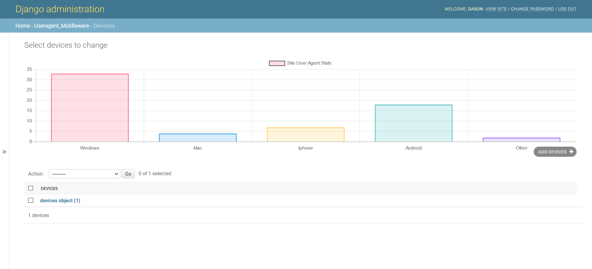

# User Agent Middleware
> A django middleware that captures user request data and extracts the HTTP_USER_AGENT from the request meta data.   
[](https://github.com/tterb/atomic-design-ui/blob/master/LICENSEs)
[![Build Status][travis-image]][travis-url]

This is a demo on how to great a custom middleware in django.


## Usage example



## Run Locally

Clone the project

```bash
  git clone https://github.com/salimdason/Django-Useragent-Middleware.git
```

Go to the project directory

```bash
  cd project
```

Install dependencies

```bash
  pip install -r Requirements/local.txt
```

Create superuser
```bash
  python manage.py createsuperuser
```

Start the server

```bash
  python manage.py runserver
```

Login to admin interface: localhost:8000/admin

## Release History

* 0.0.1
   

## Contributing

1. Fork it (<https://github.com/yourname/yourproject/fork>)
2. Create your feature branch (`git checkout -b feature/fooBar`)
3. Commit your changes (`git commit -am 'Add some fooBar'`)
4. Push to the branch (`git push origin feature/fooBar`)
5. Create a new Pull Request

<!-- Markdown link & img dfn's -->
[npm-image]: https://img.shields.io/npm/v/datadog-metrics.svg?style=flat-square
[npm-url]: https://npmjs.org/package/datadog-metrics
[npm-downloads]: https://img.shields.io/npm/dm/datadog-metrics.svg?style=flat-square
[travis-image]: https://img.shields.io/travis/dbader/node-datadog-metrics/master.svg?style=flat-square
[travis-url]: https://travis-ci.org/dbader/node-datadog-metrics
[wiki]: https://github.com/yourname/yourproject/wiki


## 🔗 Links
[](https://github.com/salimdason/)
[](https://www.linkedin.com/salimdason/)
[](https://twitter.com/moedason)

